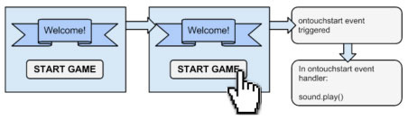
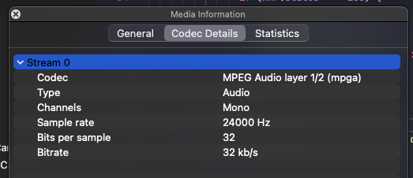
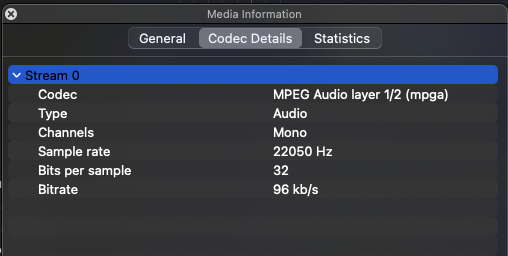

As web developers, we're always on the lookout for ways to make our web applications more engaging. One effective way is by adding audio playback. Whether it's for music, podcasts, or sound effects, integrating audio can enhance the user experience.

In this guide, we'll cover two simple methods for adding audio to your web application: using the HTML5 audio tag and JavaScript Web Audio API. We'll also cover some wired behaviours only exist on (mobile) Safari and their solutions.

## **HTML5 `<audio>` Tag: Easy and Quick**

The HTML5 audio tag is the simplest way to put audio on your web page. Here's how:

### **Basic Audio Playback:**

```html
<audio controls>
	<source 
		src="https://audio-samples.github.io/samples/mp3/blizzard_biased/sample-0.mp3" 
		type="audio/mpeg">
</audio>
```

- `<audio>` defines an audio player.
- `controls` adds play, pause, and volume controls.
- `<source>` specifies the audio file.

(run this code: [https://codepen.io/bemnlam/pen/zYyeKom](https://codepen.io/bemnlam/pen/zYyeKom))

**Auto-play: (usually) Starts the Audio Automatically**

If you want the audio to start playing as soon as the page loads, just add `autoplay` like this:

```html
<audio controls autoplay>
	<source 
		src="https://audio-samples.github.io/samples/mp3/blizzard_biased/sample-0.mp3" 
		type="audio/mpeg">
</audio>
```

Keep in mind that auto-playing audio can sometimes be annoying, so use it wisely.

Note: most modern browsers support this feature. However, it is forbidden by many mobile devices where there is no "user interaction".

**Definition of "User Interaction":**

"User interaction" refers to an action taken by the website visitor, such as clicking, tapping, or pressing a key, to initiate an event or action on the webpage. Many mobile devices prevent auto-playback of audio or video content unless the user interacts with the page first to avoid intrusive experiences.

To understand how different browsers and operating systems handle user interaction, you can refer to their respective documentation:

- Chrome: [User Activation](https://developers.google.com/web/updates/2017/09/autoplay-policy-changes)
- Firefox: [Autoplay Guide](https://developer.mozilla.org/en-US/docs/Web/Media/Autoplay_guide)
- Safari: [Autoplay Restrictions](https://developer.apple.com/documentation/webkitjs/htmlmediaelement/1632950-webkitusermediaelementrestrictions)
- iOS: [Safari Viewport Policy](https://developer.apple.com/documentation/webkitjs/viewport-policy)
- Android: [Media Playback on Android](https://developer.android.com/guide/topics/media/mediaplayer)

## **JavaScript Web Audio API: More Control**

The Web Audio API gives you more control over audio. Here's a simple example:

### **Basic Audio Playback:**

```html
<button id="playButton">Play Audio</button><script>
    const audioElement = new Audio('https://audio-samples.github.io/samples/mp3/blizzard_biased/sample-1.mp3');
    const playButton = document.getElementById('playButton');

    playButton.addEventListener('click', () => {
        audioElement.play();
    });
</script>
```

- We create an `<audio>` element but omit the `controls` attribute.
- We use the Web Audio API to control audio playback.
- The `click` event on a button triggers audio playback.

(run this code: [https://codepen.io/bemnlam/pen/qBLgaNw](https://codepen.io/bemnlam/pen/qBLgaNw))

The Web Audio API offers advanced features for real-time audio processing, making it a powerful tool for web developers. We will cover this (together with the wired behaviour of Safari) in the later sections.

## **Unlocking Auto-Play on Mobile Devices**

Auto-play restrictions on mobile devices are put in place to provide a better user experience and prevent annoying or intrusive audio playback. However, in some cases, you may have a legitimate need for auto-play functionality on your web app. Fortunately, there are ways to work around these restrictions and unlock auto-play on mobile devices.

**Utilize User Interaction Triggers**

To enable auto-play on mobile devices, ensure that the audio or video content starts playing in response to a user interaction, such as a tap or a click. This interaction can be as simple as a play button or a start button on your web page.



**That's why many web applications will display a popup or a tutorial screen with a confirm button showing user how to interact with the app. The true purpose for that is to initiate an user interaction**.

The example in the beginning of this section also demonstrates how to initiate the audio playback with a click (an user interaction).

By requiring user interaction, you comply with mobile device policies while still achieving auto-play functionality. This approach ensures a smoother user experience and reduces the likelihood of intrusive auto-play content on your web app.

## **Weird behaviours on iOS Safari**

### **1. Playing the audio after a `Promise`**

In iOS Safari, this "user interaction" rule is even more strict. If user interaction happens so early, it won't count.

The general solution is to play the audio as soon as possible right after the user interaction. Don't wait.

For example:

```html
<p>
	<h2>The audio will play after 3 second (simulate a delay audio playback after an user interaction.)</h2>
</p>
<p>
	<button id="playButton">Download and play audio</button>
</p>
<p>
	<audio id="audioElement" controls></audio>
</p>

<script>
	const playButton = document.getElementById('playButton');
	const audioElement = document.getElementById('audioElement');
	playButton.addEventListener('click', async () => {

	// Simulate a network delay of 3 seconds using a Promise.
	async function simulateNetworkDelay() {
		return new Promise(resolve => setTimeout(resolve, 3000));
	}

	try {
		// Fetch the audio file from the specified URL.
		const response = await fetch('https://audio-samples.github.io/samples/mp3/blizzard_biased/sample-0.mp3');
		
		if (!response.ok) {
			throw new Error('Failed to fetch audio file.');
		}

		// Convert the response into a blob.
		const audioBlob = await response.blob();

		// Create a Blob URL for the audio content.
		const audioUrl = URL.createObjectURL(audioBlob);

		// Set the audio element's source to the Blob URL.
		audioElement.src = audioUrl;

		// Play the audio after the network delay.
		await simulateNetworkDelay();

		// Play the audio.
		audioElement.play();
		
	} catch (error) {
		console.error('An error occurred:', error);
	}
});
</script>
```

### **2. Web Audio under Silent Mode**

iOS device exhibits specific behaviour when it comes to audio playback in silent mode. This happens when the first audio you try to play in Safari is using the JavaScript Web Audio API.

**Reproducing the Behaviour:**

For example, using iPhone 13 running iOS 17.0.2.

1. Make sure that your iPhone does not connect to any earphones or speakers.
2. Turn your iPhone into the silent mode.
3. Open the following examples in Safari:
    1. [https://audio-samples.github.io/#section-1](https://audio-samples.github.io/#section-1)
    2. [https://mdn.github.io/webaudio-examples/audio-analyser/](https://mdn.github.io/webaudio-examples/audio-analyser/)
4. Kill the Safari app. Then relaunch it.
5. Play audio [example 2](https://mdn.github.io/webaudio-examples/audio-analyser/) by clicking the "start" button
6. The audio is playing. However, it's **muted**.

Surprisingly, if you play example 2 after the [example 1](https://audio-samples.github.io/#section-1), you can listen to the audio. On the other hand, you can listen to the audio when there is a headphone being connected.

iOS Safari has its own philosophy on "delivering the best user experience" but I am so sure that these behaviour is ruining developer experience. A lot.

Note: I can't find any of the official documentation stating this behaviour. Please do let me know if you can find one.

### **Solution: Introducing a Blank Audio**

If you have to play the audio using JavaScript Web Audio API, add a HTML5 `<audio>` element to your web app and play it in advance of any upcoming audio. (Of course, you need an user interaction to start playing that blank HTML5 `<audio>`).

```html
<button id="playButton">Play Audio</button>

<p>
	<input type="checkbox" id="playMainAudio">
	<label for="playMainAudio">Play a blank &lt;audio&gt; right before the main audio to break iOS silent mode.</label>
</p>

<audio id="mainAudio" controls>
	<source type="audio/mpeg">
</audio>

<audio id="blankAudio">
	<!-- a 15 ms silent audio -->
	<source src="data:audio/mpeg;base64,//uQxAAAAAAAAAAAAAAAAAAAAAAASW5mbwAAAA8AAAADAAAGhgBVVVVVVVVVVVVVVVVVVVVVVVVVVVVVVVVVVVVVVVVVVVWqqqqqqqqqqqqqqqqqqqqqqqqqqqqqqqqqqqqqqqqqqqr///////////////////////////////////////////8AAAA5TEFNRTMuOThyAc0AAAAAAAAAABSAJAiqQgAAgAAABobxtI73AAAAAAAAAAAAAAAAAAAAAAAAAAAAAAAAAAAAAAAAAAAAAAAAAAAAAAAAAAAAAAAAAAAAAAAAAAAAAAAAAAAAAAAAAAAAAAAAAAAAAAAAAAAAAAAAAAAAAAAAAAAAAAAAAAAAAAAAAAAAAAAAAAAAAAAAAAAAAAAAAAAAAAAAAAAAAAAAAAAAAAAAAAAAAAAAAAAAAAAAAAAAAAAAAAAAAAAAAAAAAAAAAAAAAAAAAAAAAAAAAAAAAAAAAAAAAAAAAAAAAAAAAAAAAAAAAAAAAAAAAAAAAAAAAAAAAAAAAAAAAAAAAAAAAAAAAAAAAAAA//uQxAACFEII9ACZ/sJZwWEoEb8w/////N//////JcxjHjf+7/v/H2PzCCFAiDtGeyBCIx7bJJ1mmEEMy6g8mm2c8nrGABB4h2Mkmn//4z/73u773R5qHHu/j/w7Kxkzh5lWRWdsifCkNAnY9Zc1HvDAhjhSHdFkHFzLmabt/AQxSg2wwzLhHIJOBnAWwVY4zrhIYhhc2kvhYDfQ4hDi2Gmh5KyFn8EcGIrHAngNgIwVIEMf5bzbAiTRoAD///8z/KVhkkWEle6IX+d/z4fvH3BShK1e5kmjkCMoxVmXhd4ROlTKo3iipasvTilY21q19ta30/v/0/idPX1v8PNxJL6ramnOVsdvMv2akO0iSYIzdJFirtzWXCZicS9vHqvSKyqm5XJBdqBwPxyfJdykhWTZ0G0ZyTZGpLKxsNwwoRhsx3tZfhwmeOBVISm3impAC/IT/8hP/EKEM1KMdVdVKM2rHV4x7HVXZvbVVKN/qq8CiV9VL9jjH/6l6qf7MBCjZmOqsAibjcP+qqqv0oxqpa/NVW286hPo1nz2L/h8+jXt//uSxCmDU2IK/ECN98KKtE5IYzNoCfbw+u9i5r8PoadUMFPKqWL4LK3T/LCraMSHGkW4bpLXR/E6LlHOVQxmslKVJ8IULktMN06N0FKCpHCoYsjC4F+Z0NVqdNFoGSTjSiyjzLdnZ2fNqTi2eHKONONKLMPMKLONKLMPQRJGlFxZRoKcJFAYEeIFiRQkUWUeYfef//Ko04soswso40UJAgMw8wosososy0EalnZyjQUGBRQGIFggOWUacWUeYmuadrZziQKKEgQsQLAhQkUJAgMQDghltLO1onp0cpkNInSFMqlYeSEJ5AHsqFdOwy1DA2sRmRJKxdKRfLhfLw5BzUxBTUUzLjk4LjJVVVVVVVVVVVVVVVVVVVVVVVVVVVVVVVVVVVVVVVVVVVVVVVVVVUxBTUUzLjk4LjJVVVVVVVVVVVVVVVVVVVVVVVVVVVVVVVVVVVVVVVVVVVVVVVVVVVVVVVVVVVVVVVVVVVVVVVVVVVVVVVVVVVVVVVVVVVVVVVVVVVVVVVVVVVVVVVVVVVVVVVVVVVVVVVVVVVVVVVVVVf/7ksRRA8AAAaQAAAAgAAA0gAAABFVVVVVVVVVVVVVVVVVVVVVVVVVVVVVVVVVVVVVVVVVVVVVVVVVVVVVVVVVVVVVVVVVVVVVVVVVVVVVVVVVVVVVVVVVVVVVVVVVVVVVVVVVVVVVVVVVVVVVVVVVVVVVVVVVVVVVVVVVVVVVVVVVVVVVVVVVVVVVVVVVVVVVVVVVVVVVVVVVVVVVVVVVVVVVVVVVVVVVVVVVVVVVVVVVVVVVVVVVVVVVVVVVVVVVVVVVVVVVVVVVVVVVVVVVVVVVVVVVVVVVVVVVVVVVVVVVVVVVVVVVVVVVVVVVVVVVVVVVVVVVVVVVVVVVVVVVVVVVVVVVVVVVVVVVVVVVVVVVVVVVVVVVVVVVVVVVVVVVVVVVVVVVVVVVVVVVVVVVVVVVVVVVVVVVVVVVVVVVVVVVVVVVVVVVVVVVVVVVVVVVVVVVVVVVVVVVVVVVVVVVVVVVVVVVVVVVVVVVVVVVVVVVVVVVVVVVVVVVVVVVVVVVVVVVVVVVVVVVVVVVVVVVVVVVVVVVVVVVVVVVVVVVVVVU=" type="audio/mpeg">
</audio>

<script>
	const audioContext = new (window.AudioContext || window.webkitAudioContext)();
	const playButton = document.getElementById('playButton');
	const audioElement = document.getElementById('mainAudio');
	const blankAudioElement = document.getElementById('blankAudio');
	const playMainAudioCheckbox = document.getElementById('playMainAudio');

	playButton.addEventListener('click', async () => {
		const dataUrl = 'https://audio-samples.github.io/samples/mp3/blizzard_unconditional/sample-1.mp3';
		const response = await fetch(dataUrl);
		
		if (!response.ok) {
			throw new Error('Failed to fetch audio file.');
		}
		
		// Check if the checkbox is checked and play the main audio accordingly.
		if (playMainAudioCheckbox.checked) {
			console.info('Break the silent by playing a blank HTML5 audio.')
			blankAudioElement.play();
		}
		
		// Play the audio you want
		const audioBlob = await response.blob();
		const audioUrl = URL.createObjectURL(audioBlob);
		audioElement.src = audioUrl;
		audioElement.play();
	});
</script>
```

(run this demo: [https://codepen.io/bemnlam/pen/abPXmpX](https://codepen.io/bemnlam/pen/abPXmpX))

### **3. Choppy Audio Playback when Connecting an `AnalyserNode`**

`[AudioContext](https://developer.mozilla.org/en-US/docs/Web/API/AudioContext/createMediaElementSource)` and `[AnalyserNode](https://developer.mozilla.org/en-US/docs/Web/API/AnalyserNode)` are very useful components for real-time audio processing. By connecting the audio with an `AudioContext` you can control the playback and volume of the audio. Also, it's possible to build an audio visualizer.

Here is a simple example of that: [https://mdn.github.io/webaudio-examples/audio-analyser/](https://mdn.github.io/webaudio-examples/audio-analyser/).

You can also find the underlying source code here: [https://github.com/mdn/webaudio-examples/blob/main/audio-analyser/index.html](https://github.com/mdn/webaudio-examples/blob/main/audio-analyser/index.html)

However, not every audio can work with Safari well. Form my past experience, the beginning few milliseconds of certain mp3 files can be chopped after connecting the `<auido>` element with an `<AnalyserNode>`. Meanwhile, other modern browsers do not have such issue.

### **Solution: Check the MP3 file format**

You need to investigate your mp3 file metadata when this happens. I found that when the file is in a sampling rate is 24000 Hz with bitrate 32 kb/s this issue will happen:



Here is the example mp3 file: [audio_24000.mp3](assets/audio_24000.mp3)

Some services, for example, [Google's Text-to-Speech API](https://cloud.google.com/speech-to-text/docs/encoding#audio-encodings) will produce this format by default.

To solve this issue, just replace the mp3 source file with different sampling rate. For example, 22050 Hz with bitrate 96 kb/s:



Reference:

- **MelNet - Audio Samples:** [https://audio-samples.github.io/#section-1](https://audio-samples.github.io/#section-1)
- **webaudio-examples:** [https://mdn.github.io/webaudio-examples/](https://mdn.github.io/webaudio-examples/)
- audio analyzer: [https://github.com/mdn/webaudio-examples/blob/main/audio-analyser/index.html](https://github.com/mdn/webaudio-examples/blob/main/audio-analyser/index.html)