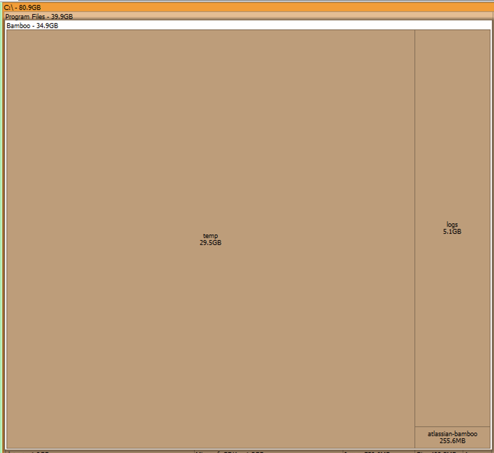

## Background

Bamboo build does not work and got these messages in deployment log: 

```verilog
18-Jan-2021 01:00:12	There is not enough space on the disk
18-Jan-2021 01:00:12	Unable to download artifact Shared artifact: [src], pattern: [**/*]
```

Use [SpaceSniff]([http://www.uderzo.it/main_products/space_sniffer/](http://www.uderzo.it/main_products/space_sniffer/)) to find out how the disk space is being used : turns out `Bamboo` folder ate up all the space:



The folder is being used to store temp files. This setting can be found at **Bamboo administration** > **System information** > **Bamboo paths** > `Temporary directory C:\Program Files\Bamboo\temp`

## Solution

You may need to stop Bamboo running before making the following changes: `C:\Program Files\Bamboo\stopBamboo.bat`

If this does not work, use Powershell and type the following command:

```verilog
PS C:\Users\Administrator> **net stop bamboo**
The Atlassian Bamboo Bamboo service is stopping........
The Atlassian Bamboo Bamboo service was stopped successfully.
```

later if you want to start it again:

```verilog
PS C:\Users\Administrator> **net start bamboo**
The Atlassian Bamboo Bamboo service is starting..
The Atlassian Bamboo Bamboo service was started successfully.
```

### Attaching an external drive to store Bamboo builds

> Assuming that the attached Drive is **E:** drive.

1. create a corresponding dir for `C:\Users\Administrator\bamboo-home` in the new drive.
2. copy the whole `bamboo-home` to the new drive.
3. Create a [Junction Link]([https://www.howtogeek.com/howto/16226/complete-guide-to-symbolic-links-symlinks-on-windows-or-linux/](https://www.howtogeek.com/howto/16226/complete-guide-to-symbolic-links-symlinks-on-windows-or-linux/)) using **[Link Shell Extension](https://schinagl.priv.at/nt/hardlinkshellext/linkshellextension.html)**
4. Right click the new folder, **Pick Link Location**
5. Back to original folder, right click and **Drop as...** > **Junction**
6. You should be able to see a link icon at the left-bottom corner of the folder.


### Deleting the stuff you may not need

#### 1. Tomcat Temp Directory

Most of the folders under `C:\Program Files\Bamboo\temp` can be deleted.


#### 2. Bamboo build dir

You may also delete some of the items under `{bamboo-home}\xml-data\build-dir` This is the `buildWorkingDir`. 

‼️ Also, please make sure that you keep `_git-repositories-cache` intact. When building the project Bamboo will look for the cached data in this dir. Removing this will cause your build plan epic fail. You may need to re-configure your build plan/branches.

`E:\bamboo-home\xml-data\builds` contains build logs and I don't recommend to delete the most recent items.

### Add Tomcat Log Retention Policies

Logs will be kept for at most 14 days.

[https://gist.github.com/jmurphyau/743c6d712f800640a35b0f4558f4dbd9](https://gist.github.com/jmurphyau/743c6d712f800640a35b0f4558f4dbd9)

Before:

```
1catalina.org.apache.juli.FileHandler.level = FINE
1catalina.org.apache.juli.FileHandler.directory = ${catalina.base}/logs
1catalina.org.apache.juli.FileHandler.prefix = catalina.
```

After:

```
1catalina.org.apache.juli.FileHandler.level = FINE
1catalina.org.apache.juli.FileHandler.directory = ${catalina.base}/logs
1catalina.org.apache.juli.FileHandler.prefix = catalina.
1catalina.org.apache.juli.FileHandler.maxDays = 14
```

### Clean the Directory folder after Build/Deployment

#### 1. Build step

Check **Clean working directory after each build** for all the jobs in all stages.


#### 2. Deployment plan

Add a **Clean working directory task** as the last step of the plan.


## Conclusion

Addressing the "Not Enough Space" issue in Bamboo involves a combination of efficient disk management, strategic use of external drives, and proper cleanup routines. By implementing **junction links**, adjusting **log retention policies**, and automating **directory cleanup**, you can prevent future disruptions and maintain optimal performance. These steps not only resolve immediate concerns but also ensure a sustainable environment for your Bamboo builds and deployments.