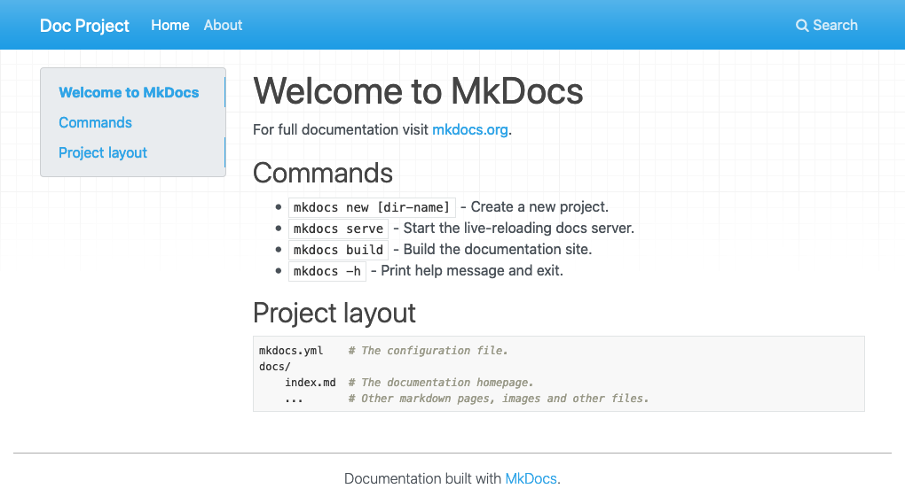
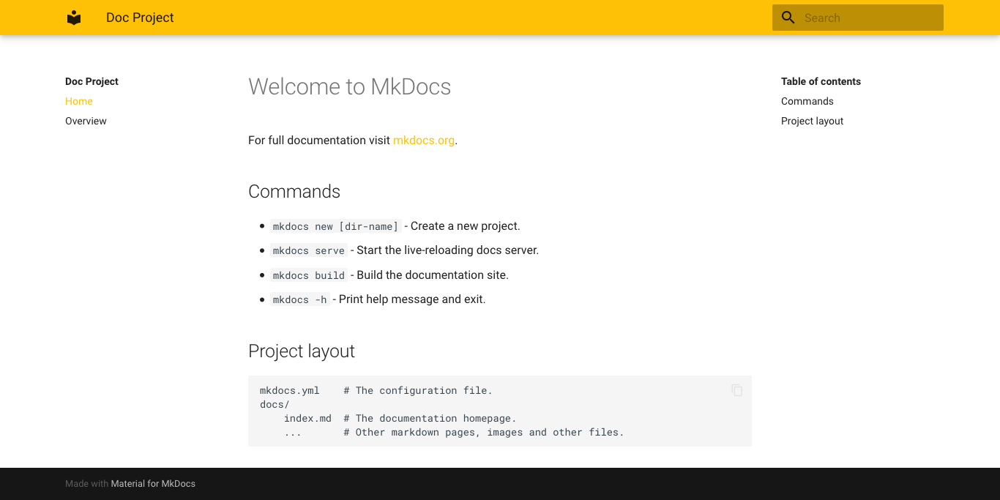
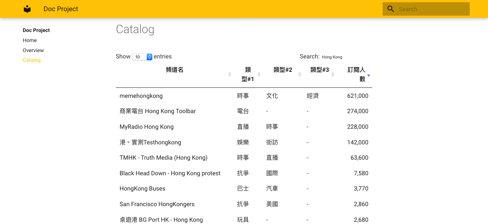

## Overview ##

I created a static website using **MkDocs** and deployed to [**GitLab Pages**](https://docs.gitlab.com/ee/user/project/pages/). This is what I did: https://bemn-proof-of-concept.gitlab.io/mkdoc/.

### Table of Contents ###

- [MkDocs](#intro)
  - [Preparation](#preparation)
  - [Up and Run](#up-and-run)
  - [Add a new page](#add-a-new-page)
  - [Theming](#theming)
  - [Custom Resources](#custom-resources)
- [GitLab Pages](#gitlab-pages)
  - [.gitlab-ci.yml](#gitlab-ci-yml)
  - [Build and Deploy](#build-and-deploy)
- [Conclusion](#conclusion)

---

## MkDocs {#intro}
From [MkDocs' official website](https://www.mkdocs.org/):
> MkDocs is a **fast**, **simple** and **downright gorgeous** static site generator that's geared towards building project documentation. Documentation source files are written in Markdown, and configured with a single YAML configuration file.

In my opinion, setting up a static site using MkDocs is really straightforward. It's easy to change the theme and insert custom styles/scripts. [Keep it simple, stupid](https://en.m.wikipedia.org/wiki/KISS_principle). That's what I need.


### Preparation {#preparation} ###
Make sure that you have the following tools:
1. **python 3.x** and **pip**. Install it via [executable](https://www.python.org/downloads/) from the official website, or using tools like [Homebrew](https://brew.sh/).
```bash
$ python --version
Python 3.8.2
$ pip --version
pip 20.0.2 from /usr/local/lib/python3.8/site-packages/pip (python 3.8)
```
2. a **GitLab** account. You can use other service like [Github Pages](https://pages.github.com/), Amazon S3, etc.
3. (optional) [a markdown cheatsheet](https://www.markdownguide.org/cheat-sheet/).

(For me, the most difficult part is how to get the python and pip versions right. In Mac the built-in python version is 2.7 but we need python 3 to install `pip`.)

### Up and Run {#up-and-run} ###
```bash
$ pip install mkdocs
$ mkdocs --version
mkdocs, version 1.1.2
```

Assuming that your project folder is `doc-project`:
```bash
$ mkdocs new doc-project
$ cd doc-project
```

A MkDocs project is then created with the following folder structure:
```
doc-project
├── docs
│   └── index.md
├── img
│   └── favicon.ico
└── mkdocs.yml
```

Let's run the site:
```bash
$ mkdocs serve
INFO    -  Building documentation...
INFO    -  Cleaning site directory
INFO    -  Documentation built in 1.65 seconds
[I 200612 23:30:19 server:334] Serving on http://127.0.0.1:8000
```
And check it out at [http://127.0.0.1:8000](http://127.0.0.1:8000)!



### Add a new page {#add-a-new-page} ###

#### The content ####

Remember, all the documents should place under `docs`. Let's create an Overview page:
```bash
$ cd docs
$ touch overview.md
```
After that, add some content to `overview.md`.

#### The menu ####

If you want the visitors to reach the overview page, you need to add an url in the menu. Let's edit `mkdocs.yml`, the site config file:
```yml
# In mkdocs.yml...
site_name: Doc Project ## change your site name here.
nav:
  - Home: index.md
  - Overview: overview.md ## add this line.
```
You will see a new link called *Overview* in the menu. If you want to set your site name now, change the value of `site_name`.

So that's it. That's how to add a new page.

### Theming {#theming} ###

You can apply a custom theme to MkDocs. [This page](https://github.com/mkdocs/mkdocs/wiki/MkDocs-Themes) contains many themes contributed by the community.

In this section, I will apply the [Material Design theme](https://github.com/squidfunk/mkdocs-material) to my MkDocs site.

Stop running your site and install the theme by:
```bash
$ pip install mkdocs-material
```

Update the `mkdocs.yml` again:
```yml
# In mkdocs.yml...
site_name: Doc Project

nav:
  - Home: index.md
  - Overview: overview.md

## Add this section
theme:
  name: material
  palette: ## Add this sub-section if you want to change the theme color
    scheme: amber
    primary: amber
    accent: orange
```

Start the site:

```bash
$ mkdocs serve
```

You will see MkDocs is dressing the amber Material Design theme.



### Custom Resources {#custom-resources} ###

Sometimes you may want to add custom CSS or JS. In MkDocs, you can do it by adding `extra_css` and `extra_javascript` sections in `mkdocs.yml`.

I created a `catalog` page which contains a table written in markdown. Also, I want to apply [jQuery DataTables](https://www.datatables.net/) to make the table more interactive. Therefore, I added the related js libraries and related css file to MkDocs. You can see the result [here](https://bemn-proof-of-concept.gitlab.io/mkdoc/catalog/).

**Exercice:** create a `catalog.md` file and add a markdown table in it. 

Next, add the custom resource sections to the config file:

```yml
# In mkdocs.yml...
site_name: Doc Project
nav:
  - Home: index.md
  - Catalog: catalog.md ## The catalog page you created in the exercise.

theme:
  name: material
  palette:
    scheme: amber
    primary: amber
    accent: orange

## Custom js files.
extra_javascript:
  - https://code.jquery.com/jquery-3.5.1.min.js
  - https://cdn.datatables.net/1.10.21/js/jquery.dataTables.min.js
  - scripts/site.js

## Custom css files.
extra_css:
  - https://cdn.datatables.net/1.10.21/css/jquery.dataTables.min.css
```

Create a custom js file:
```bash
$ cd docs
$ mkdir scripts
$ cd scripts
$ touch site.js
```

Now in your `site.js` file:
```js
$(document).ready( function () {
    $('table').DataTable();
});
```

Afer that, you should be able to see an interactive table in the catalog page.




---


## GitLab Pages {#gitlab-pages} ##

Create a GitLab repository under your personal space or a project group. The url will be something like `https://gitlab.com/{username or project group name}/{repo name}`.

Clone the repo you created and create the following items:
```bash
$ mkdir src
$ touch .gitlab-ci.yml
```

Place your MkDoc items (i.e. the `doc-project` folder) under `src`. See the following folder structure:
```
(root of the repo)
├── .gitlab-ci.yml
└── src
    └── doc-project
```

### .gitlab-ci.yml {#gitlab-ci-yml} ###

The `.gitlab-ci.yml` is a GitLab-specific file. GitLab will read and run the steps in the file. We need to tell GitLab how to generate and deploy our static MkDocs website. In this file:

```yml
# In .gitlab-ci.yml...
image: python:3.8-buster ## MkDocs requies python.

pages:
  stage: deploy ## tell GitLab to deploy the website in this step.
  before_script:
    - pip install mkdocs ## install MkDocs.
    - pip install mkdocs-material ## install the theme.
  script:
    - cd ./src/doc-project
    - mkdocs build ## built the site.
    - mv site ../../public
  artifacts:
    paths:
    - public
  ## Uncomment the following section if you want to run this step under master branch only.
  # only:
  # - master 
```

So basically it tells GitLab to install the tools required under python 3.8 environment and deploy the website after the site is generated.

Try to run the following command if you want to generate the site locally:

```bash
$ mkdocs build
```

The generated site is located under  `doc-project/site/` .

In order to display the website properly, you need to place the generated site under the `public` folder and let GitLab knows the **artifact** inside is the website you want to deploy. 

### Build and Deploy {#build-and-deploy} ###

Push the code to GitLab and the site should build automatically. Check out the status of the build under **CI/CD** -->  **Pipelines**.



Check out your website now. The url is `https://{username or project group name}.gitlab.io/{repo name}/`.

---

## Conclusion {#conclusion} ##

In this tutorial, we created a static site with custom theme, styles and js library by using MkDocs. After that, we set up a CI/CD pipeline on GitLab for building and deploying this static site to GitLab Pages.

