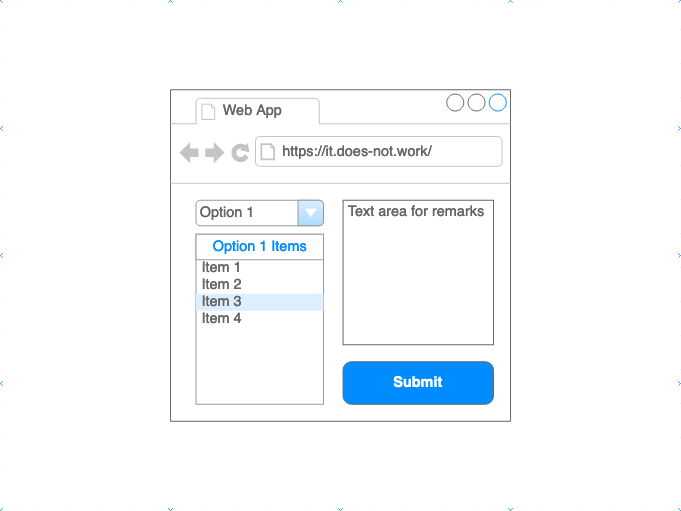
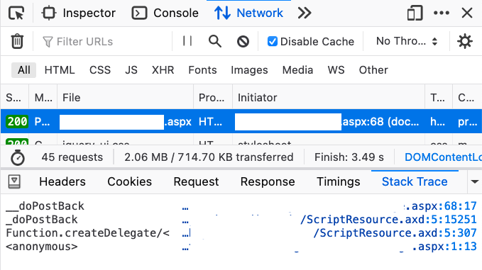
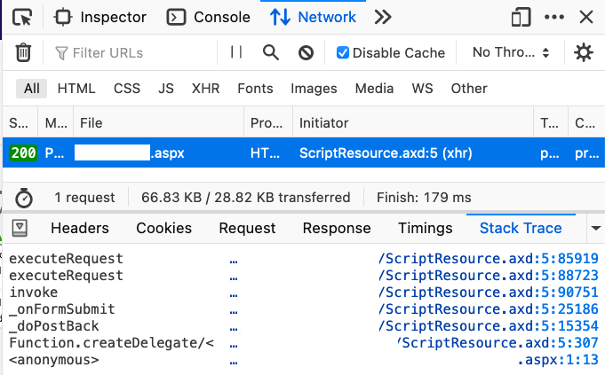

## 😨 Problem

> TL;DR: see [Summary](#summary) and [the working code snippet](#the-working-code-snippet) if you want to try it right away.

In my company there is an old Web Form Website running .NET Framework 3.5. I migrated it to an ASP.NET Web Form Application running .NET Framework 4.7.2 few months ago. The website is running just like the old one but recently a user reported that:

> **a `<select>` list which should triggers an AJAX call and refresh part of the page does not work. Instead, the page is reloaded everytime when the item in the `<select>` list is changed.**

I used almost a day to figure out what's (probably) happened and I hope that this article will be helpful to someone in the future who (still) encounter this problem.

## Expected vs Actual Behavior

There is a `<form>` containing a `<select>` list (generated by [ `<asp:DropDownList>`](https://docs.microsoft.com/en-us/dotnet/api/system.web.ui.webcontrols.dropdownlist?view=netframework-4.8)). When the selected option is changed, an AJAX call will be fired and new items will be fetched. Besides, there is a text area for user to input remarks. A submit button will submit the form.



### Expected

The page will not be reloaded when the selected option is changed. The content in the text area retains.

### Actual

Once the selected option is changed, a form POST is fired (instead of an AJAX call). The content in the text area is therefore being cleaned.

This is related to AJAX calls so the first thing I checked was how the AJAX call was initiated.

## 😀 Solution (Part 1): Updating `AjaxControlToolkit`

In the `.aspx` file I saw a `<asp:UpdatePanel>` and a `<asp:DropDownList>`. This is the simplified structure of that part:

```xml
<asp:UpdatePanel runat="server" ID="UpdatePanel2" UpdateMode="Conditional" ChildrenAsTriggers="true">
  <ContentTemplate>
    <asp:DropDownList runat="server" ID="ddItemTypes" AutoPostBack="true" OnSelectedIndexChanged="ddItemTypes_OnSelectedIndexChanged" />
  </ContentTemplate>            
</asp:UpdatePanel>
```

`AutoPostBack` is there so the app should use `AjaxControlToolkit` to make AJAX calls (I guess that's the standard right?).

### Nuget Package Update

I checked the `package.config`:

```xml
<package id="AjaxControlToolkit" version="4.1.50508" targetFramework="net35" />
```

Looks like the `targetFramework` is not right. Maybe it's time to update the package too.

```xml
<package id="AjaxControlToolkit" version="20.1.0" targetFramework="net472" />
```

### Some Breaking Changes

[AjaxControlToolkit](https://github.com/DevExpress/AjaxControlToolkit) has some breaking changes since version 15+. In short, you need to:

1. Uninstall the old version and install the new version of [`AjaxControlToolkit`](https://www.nuget.org/packages/AjaxControlToolkit).

2. Change `<asp:ToolkitScriptManager>` to `<asp:ScriptManager>`

3. Remove some unused configs in `web.config` (see [this](https://github.com/DevExpress/AjaxControlToolkit/wiki/Upgrading-from-v7.x-and-below#3---clean-up-webconfig))

4. [Optional] Install [`AjaxControlToolkit.HtmlEditor.Sanitizer`](https://www.nuget.org/packages/AjaxControlToolkit.HtmlEditor.Sanitizer/)

    - Change the namespace `AjaxControlToolkit.HTMLEditor` to `AjaxControlToolkit.HtmlEditor`
    
    - Change the namespace `AjaxControlToolkit.HTMLEditor.ToolbarButton` to `AjaxControlToolkit.HtmlEditor.ToolbarButtons`

You may also read[ the official complete migration guide](https://github.com/DevExpress/AjaxControlToolkit/wiki/Upgrading-from-v7.x-and-below#3---clean-up-webconfig).

After I upgrade the Nuget package, the AJAX calls was working partially: It only works on Chromium-base browsers like Chrome and Edge. However, **it does not work on Firefox (85.0) and Safari (14.0.1)**.

 😐 😐 😐 
### Different `__doPostBack()` in Firefox?

This is what I got from Firefox's dev tool:



The initiator is from `__doPostBack()` in the `.aspx` page. In Chrome, it's from `ScriptResource.axd`. Below is the expected call stack: the call is an XHR request fired from `ScriptResource.axd`.



Looks like the stack items from bottom to `_doPostBack()` are the same.  I therefore dug into `_doPostBack()` and eventually found this piece of code in `ScriptResource.axd`:

```js
if (!this._postBackSettings.async) {            
    form.onsubmit = this._onsubmit;            
    this._originalDoPostBack(eventTarget, eventArgument);            
    form.onsubmit = null;            
    return;        
}
```

if `this._postBackSettings.async` is `false`, `_originaldoPostBack()` will be called and that is the `__doPostBack()` function defined in the `.aspx` page. **This will trigger a page reload instead of an AJAX call**.

Furthermore, I found that the `asyncTarget` in `_postBackSettings ` is `null` but in Chrome that target is the `<select>` list.


> In Firefox (v85.0) the javascript event initiated is somehow keep propagating to a higher level than the `<select>` list (probably to the form's level) and therefore being treated as a form POST instead of an AJAX call.

## 😀 Solution (Part 2): Adding  `<asp:AsyncPostBackTrigger>`

I did some research related to the Firefox-specific page reload and seems none of them were talking about the issue I met. I tried to study the fundamentals of this **PostBack** behaviour.

Finally I got this article [**Avoid (Prevent) Page refresh (PostBack) after SelectedIndexChanged is fired in ASP.Net DropDownList**](https://www.aspsnippets.com/Articles/Avoid-Prevent-Page-refresh-PostBack-after-SelectedIndexChanged-is-fired-in-ASPNet-DropDownList.aspx). It suggested what I might missing is an `asp:AsyncPostBackTrigger`.

Also, [this StackOverflow answer](https://stackoverflow.com/questions/728043/how-to-stop-updatepanel-from-causing-whole-page-postback/728061#728061) menitoned the `asp:AsyncPostBackTrigger` thing. 

So my understanding is:

> When using the `ScriptManager` (i.e. the one we introduced when updating the `AjaxControlToolkit`), we need to define an `asp:AsyncPostBackTrigger` `Trigger` in order to make the call AJAX.

Therefore, I added a `Trigger` section to the `.aspx` file:

```xml
<Triggers>
  <asp:AsyncPostBackTrigger ControlID="ddItemTypes" EventName="SelectedIndexChanged" />
</Triggers>
```

This `Trigger` section should be placed under the same `<asp:UpdatePanel>` with the `<asp:DropDownList>`. Here is the complete snippet:

### The Working Code Snippet

```xml
<asp:UpdatePanel runat="server" ID="UpdatePanel2" UpdateMode="Conditional" ChildrenAsTriggers="true">
  <ContentTemplate>
    <asp:DropDownList runat="server" ID="ddItemTypes" AutoPostBack="true" OnSelectedIndexChanged="ddItemTypes_OnSelectedIndexChanged" />
  </ContentTemplate>
  <Triggers>
    <asp:AsyncPostBackTrigger ControlID="ddItemTypes" EventName="SelectedIndexChanged" />
  </Triggers>
</asp:UpdatePanel>
```

Note:
1. `EventName` is optional here but since I just want this trigger to listen the `SelectedIndexChanged` event, I add them all. 

2. The `ControlID` has to be an exact match with the `ID` of `<asp:DropDownList>`.

After I added the `<asp:AsyncPostBackTrigger>`, all the browsers including Chrome, Edge, Firefox (85.0) and Safari (14.0.1) are working.

## Summary

When your .NET 4.5+ ASP.NET Web Form Application using `AjaxControlToolkit` does not work as expected and cause the controls like `<asp:DropDownList>` cannot fire an AJAX call (but triggers a form POST), make sure that:

1. The `AjaxControlToolkit` Nuget package is up to date (and did the proper migration steps [here](https://github.com/DevExpress/AjaxControlToolkit/wiki/Upgrading-from-v7.x-and-below#3---clean-up-webconfig)).

2. The `<asp:UpdatePanel>` section should contain a `<Triggers>` section. In that section there is an `<asp:AsyncPostBackTrigger>` with `ControlID` same as the `ID` of your control (which is also placed under the same UpdatePanel section).

