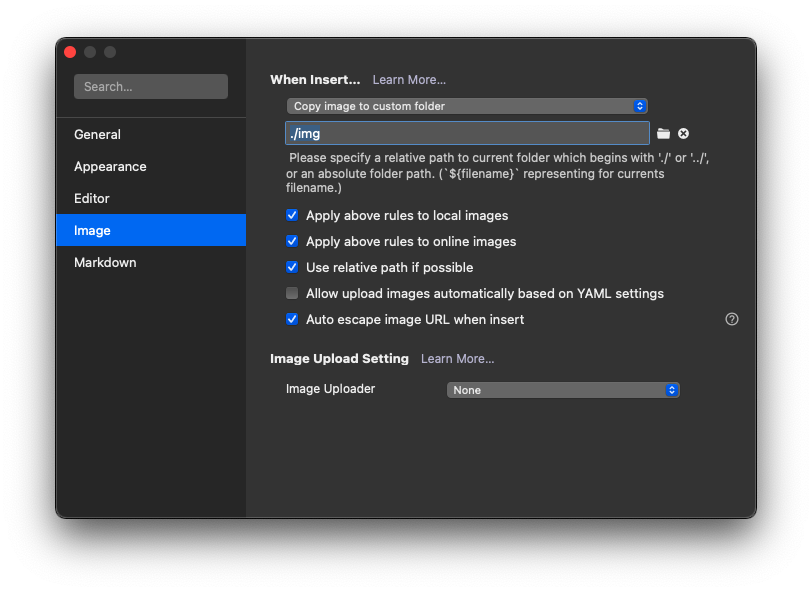

## Overview


I set up this hugo blog and hosted it on GitHub page. At first, I just want to make it work: **showing some text and images**. However, I realized that:

1. placing the **images and posts place under different directories** will make this blog become unmanagable.
2. I cannot see the images while writing a post because of (1). I have to switch to my browser when I want to see if the image has been inserted correctly.
3. **launching the markdown editor and start hugo** after creating a new file will be a very good idea.

Therefore I use some time to re-organize the image and posts and created a script to help me to start writing a new post.

## Using Page Bundle to Group resouces

After reading the Hugo's documentation I think the [page-bundles](https://gohugo.io/content-management/organization/#page-bundles) feature is what I need. For each post with images, I will create a [Leaf Bundle](https://gohugo.io/content-management/page-bundles/) like the following:

```bash
my-blog-post
├── img
│   ├── image-1.png
│   ├── image-2.png
│   └── image-n.png
├── index.md
└── thumbnail.jpg
```

### Insert an Image

For example, the blog post will have a relative url `/posts/my-blog-post/`. When I using a markdown editor to write the post, I can place all the images under `/img` and use the relative url:

```markdown
I can insert an image like this: 
```

By doing so, I can see the image right away and I don't need to do special handling when generating the blog post using Hugo.

### Cover Image

Since the cover image will be placed in the front matter and can be seen in browser only, I place it under the same directory with the blog post (i.e. `index.md`). In the blog post:

```yaml
---
title: My Blog Post
cover_image: /posts/my-blog-post/thumbnail.jpg
---
```

I will make use of the value in thumbnail and combine with the site root to generate an absolute url. The absolute url can then be used in meta data like `og:image`. Good for SEO.

### Bonus: Git Repository

I know this is weird but I split my GitHub page into 2 repositories: the main repo, and a submodule contains all my raw markdown files of my blog posts. I think that will be more organized and I can get all the text files only. Placing the image out of the `posts/` folder is kinda breaking this purpose.

Once I grouped the image with the markdown files, I can finally keep my content organized again! In short, I created a problem and then solved it 😅

## Script to start a new post

I love to use [Typora](https://typora.io/) to write my posts. However, it's vary painful to manage the images. If I pasting an image to Typora it will store my image into somewhere out of the git repository. Moving the images back to the repository and changing the image pathes is purly a waste of time.


### Insert Images to Typora

Luckily, the image issue is solved once I group the post and image under the same folder. What I have to do is change the image setting in Typora:



Choose **Copy image to custom folder** and set the value as `./img`.

### Shell Script to launch everything

My current workflow to start a new post:

1. launch Terminal and go to the blog post's repo.
2. create a new markdown file.
3. launch Typora.
4. launch Hugo to see the result.

I automated the above steps using the following script:

```zsh
#!/bin/zsh
read -p "Create a new buldled post (e.g. hello-world): "  filename

if [ -z "$filename" ]
then
   echo "Filename cannot be empty. Try again."
else
    cd ./blog
    echo "   1. Creating new post...    "
    hugo new posts/${filename}/index.md

    echo "   2. Launching Typora...     "
    open -a Typora ./content/posts/${filename}/index.md &

    echo "   3. Launching browser...    "
    open http://localhost:1313/posts/${filename}

    echo "   4. Starting dev server...  "
    hugo serve -D
fi% 
```

To launch an app from Terminal, you can do this:

```
open -a Typora &
```

Remember to have a `&` at the end. Otherwise the application will be closed once you close the Terminal!

