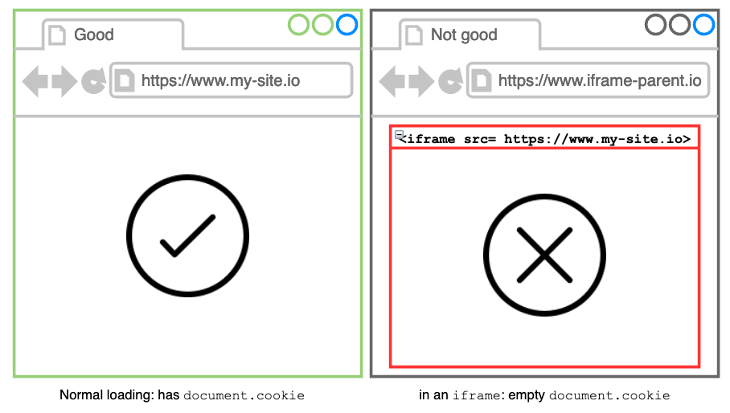
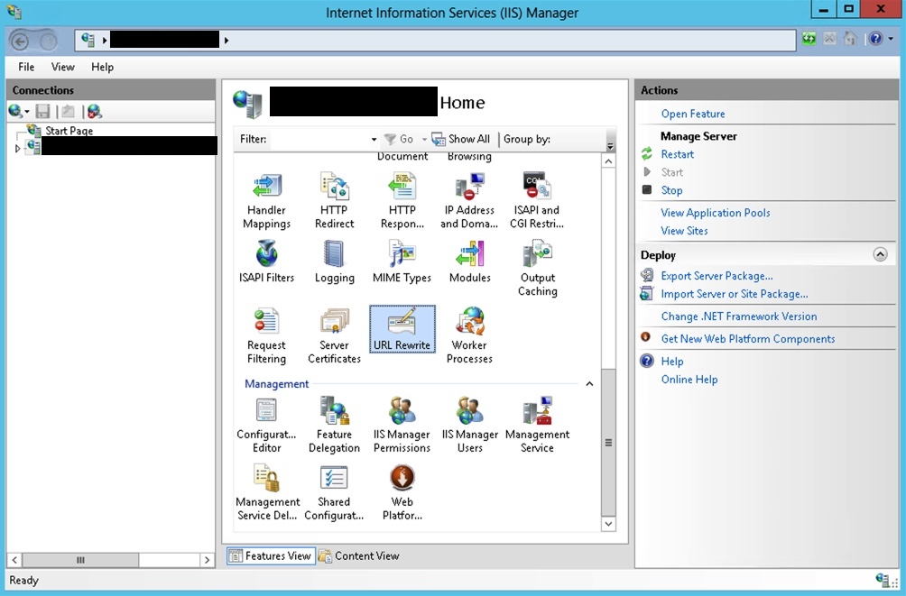
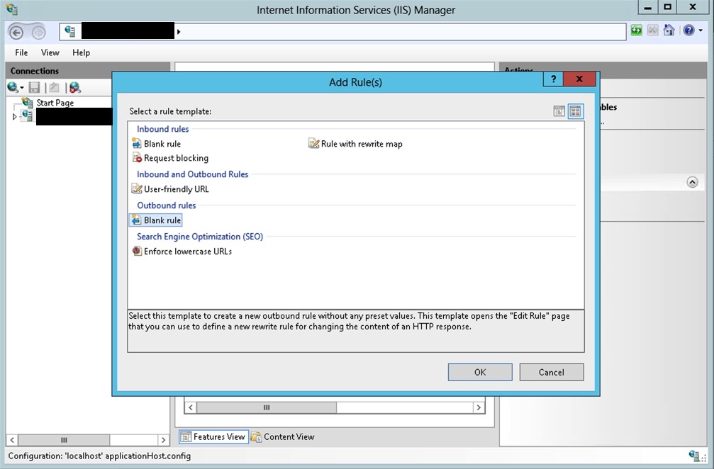
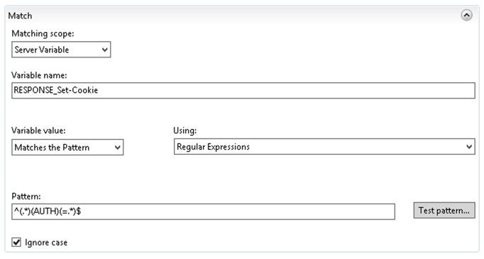
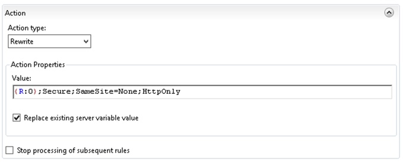

## 😨 Problem

There is a internal web application which showing an article from another website in an `<iframe>`. In order to read the full article the user has to login to the website (i.e. a special Form cookie is required.)

A user reported:

> I login to the website in a separated browser tab. I can read the full article. However, when I browing the same item in the internal web app, it requires me to login and I am failed to login (in that `<iframe>`).

I cannot reproduce this using my browser (Firefox v85). This issue happens on Chrome v88.



## It's empty: `Document.cookie`

I suspect this is something related to my cookie. I check the cookie using `document.cookie` in Dev tool's console. It's empty when I load the website inside the `<iframe>`.

However, `document.cookie` should contain something after I login to the website, right?

[Here](https://bugs.chromium.org/p/chromium/issues/detail?id=1062162) and [here](https://support.google.com/chrome/thread/33543699?hl=en) show the exact same issue reported by other chromium user. Turns out it's about the **updated cookie policy in Chrome**.

## The cookie policy

I inspected the cookie of the website: it's just a cookie with `HttpOnly` attribute and othing else. So, something else is missing in the cookie response, right?

### `SameSite`

The modern browsers (e.g. latest Chrome and coming versions of Firefox)  require the developer to define an explicit `SameSite` policy.  You can see [SameSite cookies explained](https://web.dev/samesite-cookies-explained/) for details and choose the suiteable value.

### `Secure` and  `HttpOnly`

The cookie has to be served via `HTTPS`. Hence, those attributes are also required.

I found that [Set-Cookie - HTTP | MDN](https://developer.mozilla.org/en-US/docs/Web/HTTP/Headers/Set-Cookie) is a good documentation for you to check all the available attributes related to the `Set-Cookie`HTTP response header.

I know what might be missing now but how can I fix it? The websites are running on **IIS** and there are **multiple sites** has the same cookie problem. A quick fix is required and **better don't alter the code**.

## 😀 Solution: Enforcing cookie responses on IIS

### Advanced: change the config file directly

If you feel confident to modify the server config directly, open this file:

```batch
%windir%\System32\inetsrv\config\applicationHost.config
```

It's a XML file containing the server-level configs.

Find the <outboundRules> section under `system.webServer > rewrite` If no, create one:

```xml
<system.webServer>
  <rewrite>
    <outboundRules>
    <rule name="AddCookiePolicy">
      <match serverVariable="RESPONSE_Set-Cookie" pattern="^(.*)(AUTH)(=.*)$" />
      <action type="Rewrite" value="{R:0};SameSite=None;Secure;HttpOnly">
    </rule>
    </outboundRules>
  </rewrite>
</system.webServer>
```

> You need to change the regex of the `pattern` attribute. I use `^(.*)(AUTH)(=.*)$` because there are multiple websites and all the auth cookie names are ended with `AUTH`.

> Make sure that your regex should have a matching group so that you can make use of it in the `action` section (i.e. the `{R:0}`)

Save the file and it's done.

#### Verify the config

Launch the **IIS manager** and choose the **Configuration Editor** on the Server level (not website level). Check the configuration collection under `system.webServer/rewrite/outboundRules` . You should see the config named `AddCookiePolicy`.

### Easy: Add an outbound rule in IIS Manager

If you want to be safe, launch the **IIS Manager** and set the rule. 

1. Select the **URL Rewrite** option at the **Server** level:
   
   

2. Choose **Blank rule** under **Outbound rules** section. Click **OK**.
   
   

3. Set the matching criteria:
   
   - Matching scope: **Server Variable**.
   
   - Variable name: `RESPONSE_Set-Cookie`.
   
   - Variable value: **Matches the Pattern** using **Regular Expressions**.
   
   - Pattern: `^(.*)(AUTH)(=.*)$" />`. You should change this regex in order to match your use case.
   
   - **Ignore case**.
   
   

4. Set the **Action**:
   
   - Value: `{R:0};Secure;SameSite=None;HttpOnly`
   
   - **Replace existing server variable value**
   
   

5. Click **Apply** to enable the rule.

6. Done.

After I set this outbound rewrite rule for the cookies, I can see the full article loaded inside the `<iframe>`. Problem solved.

## 🎯 Conslusion

When you dealing with cookies in modern browsers, set the **correct cookie response attributes** including an explicit `SameSite` policy, a `HttpOnly` and `Secure`:

```
Set-Cookie: {name}={value}; SameSite=None;HttpOnly;Secure
```

In order to add those attributes in a **.NET Framework web app running on IIS**, you can simply define an **outbound rule** rewrite rule on the server level of the **IIS Manager**.

