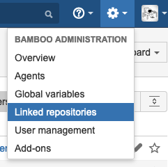

> This is the introduction related to my experience on using Atlassian Bamboo / MSBuild / MSDeploy / IIS, I will cover the build process / setup in the coming articles.

# Preface

This is an article talking about **my experience (≠ 100% solution. ≠ golden rule on CI/CD)** on using [Atlassian Bamboo](https://www.atlassian.com/software/bamboo). It is **a tool for [continuous integration, deployment, and delivery](https://www.atlassian.com/continuous-delivery/principles/continuous-integration-vs-delivery-vs-deployment)**. I use this tool for all the **.NET-based web applications running on the Windows ecosystem**.

> Note on 2020: [Bitbucket Pipelines](https://bitbucket.org/product/features/pipelines) is a newer service created by Atlassian. If you are building applications other then [Windows](https://bitbucket.org/site/master/issues/13452/support-for-native-windows-net-builds-on), [macOS, or iOS](https://bitbucket.org/site/master/issues/13719/support-for-macos-ios-in-pipelines) applications then I strongly recommend you to use this instead of Bamboo.


# CI/CD principles

**In my opinion**, when you start designing your CI/CD workflows:

1. Make things **predictable**.
2. Think of the **deployment (CD) first**, then work backward to the **integration (CI)** part.
3. Use ***Gitflow*** in your source code.

# Fundamentals of Bamboo

The menu in Bamboo (version 6.5.0) contains 3 parts:  

- *Projects*, 
- *Build* and 
- *Deploy*.


## Deployment (CD)

Here is a typical **deployment project summary** looks like:


You can check this out by clicking **Deploy** > **All Deployment Projects**. After that, choose one of the item on the list.

### Glossary

*Artifact*: The content built in the CI part.

*Deployment Environment*: The place the *artifacts* should go to.

*Release*: A unique (and usually auto-increment) identifier of this deployment.

*Deployment Project*: A collection of build plans.

## Build (CI)

Here is a typical build dashboard:


This is the default front page of Bamboo. You can also check this out by clicking **Build** > **All Build Plans**.

### Glossary

*Build*: The build result of the default plan.

*Build Plan*: Usually it refers to the definitions of all build-related configuratoins. However, sometimes it *also* refers to the **default build barnch** or the **default branch configurations**.

I will try to avoid using the term *build plan* in this article as it is a bit confusing. I will use :

- *default branch configuratoins* to indicate the default settings of a *build plan*;

- *default build branch* to indicate the branch associated to the *default branch configuratoins*.
- When I use the word *build plan*, it refers to the item listed under **Plan** column in the build dashboard.

*Build Project*: Similar to *Deployment Project*, it's a collection of *build plans*.

## Git

From the basic assumption in the [CI/CD principles, pt. 3](#cicd-principles) all the repositories are using [Gitflow](https://nvie.com/posts/a-successful-git-branching-model/). I will use the following conventions when talking about the CI settings.

*Default build branch*: git's `develop` branch. 

*Build branch*: All the other git's branches, including `feature/*`, `release/*`, `hotfix/*`, `master`

*Master branch*: git's `master` branch

*Linked Repository*: Store all the git repository connection setups for later user in CI/CD steps. It's under **⚙️ (Bamboo Administration)** > **Linked repositories**.



This is an example for a class library:


And this is an example for website:


Next, I will talk about how to **design** a CD flow, then a CI flow.

# Designing a CI/CD workflow

> Assumption: you are using [*gitflow*](https://datasift.github.io/gitflow/IntroducingGitFlow.html) to manage your git repository.

In short:

**Deployment**

- 1 *deoloyment project*, many *deployment plans*.
- 1 destination, 1 *deployment plan*.

**Integration**

- 1 Bitbucket git repository, (usually) 1 Bamboo *build plan*
  - build the `develop` branch using **default plan configuration**
  - git branch <--> *Branch config* of a build plan
- 1 Bitbucket project,  1Bamboo *build project*

## Deployment (CD)

All the deployments in my team can be categorized in to 2 types: either a **library** (i.e. a nuget package) or a **website** (i.e. an IIS website).

### Nuget Packages

My team is using [MyGet](https://myget.org/) to host private packages. So, there is only 1 destination for my *artifact* goes.


This is how I organize the *deployment project*:


```
Deployment Project
├── Production environment: for builds from master
└── Pre-release environment: all other branches
```


### Websites

We have 2 web servers for production and other environments has a corresponding web server. All running IIS. On the other hand, some of the websites are hosting under a sub-directory (as a sub-site).

Therefore, an *artifact* may goes to multiple destinations.

In my design, 1 *deployment environment* responsibles for 1 destination (i.e. 1 IIS web server).


So you may ask: why not 1 deployment environment for 1 environment? Here's why:

#### 1-to-1 mapping of *deployment environment* and *IIS website*


##### The bad

One of the downside is: It takes longer time to deploy all websites. Consider the case of deploying 2 *deployment projects* at the same time, and each project has multiple *deployment environments*. The sequence of deployment activities can be:

1. deploy site A to environment A 
2. deploy site B to environment A
3. deploy site A to environment B (triggered by activity 1.)
4. deploy site B to environment B (triggered by activity 2.)

Which means I have to wait for the deployment of another website.

##### The good

The biggest advantage of doing so is that modefying one *deployment environment* does not affect any settings of the other *deployment environments*. Then, I can do the following things:

- A/B testing
- Rollback the version of a specific web server
- Check out the audit log / deployment history for a particular web server

Moreover, you can see the status of all environments in the **All Deployment Projects** page (**Deploy** > **All Deployment Projects**).

- If deployment of a particular web server is failed, I am able to find out which server is it easily
- Plus, I can just re-deploy to that particuler web server

You can create a new *deployment environment* by cloning an existing one (from the same *deployment project* or from another one). Thus, this is not a tedious task.

(I am not sure about the above observation and please do let me know if I got something wrong or there are any better solutions.)

##### My decision

This is how I organize the *deployment project*:


```
Deployment Project
├── Production (A) environment: for builds from master / release
├── Production (B) environment: for builds from master / release
├── Staging environment: all other branches
└── UAT environment: all other branches
```

## Build (CI)

Similarly, my team has to build nuget packages, .NET Framework and .NET Core web applications.

In my case, the CI part has a close relationship with the **gitflow**. 

### Nuget Packages

I need to build 2 kinds of *artifacts*:

- Testing package: **Prerelease**;
- Production package; **Release** (used by other solutions/projects in production) deployment.

#### Plan/Branch configurations

(See the [Websites](#default-configurations-develop) section.)


### Websites

I need to build 2-3 kinds of *artifacts*:

- For **UAT** environment;
- For **Staging** environment (this environment is not 24/7 and will be set up when necessary);
- For **Production** environment.


#### Default configurations: `develop`

For the default settings in a *build plan*, always choose the `develop` as the main branch and allow Bamboo to create/remove all the `feature/*`, `hotfix/*` branches.

#### Production configurations: `master`

Define a build plan for `master` branch. Uncheck **Clean up plan branch automatically** under **Branch details** tab to  prevent this branch being deleted by Bamboo. 

##### Note on `release` branches

I ususlly not using `release` branch. When I use that, I will set up a build branch **manually**, just like the `master`.

#### Staging configurations: `staging`

Just like the set up of **production configurations**. However, change the variables for the staging environment.


You may also need to override the *default branch configurations* under the **Variables** tab.


You can find these tabs under form the top menu: **Build** > **All build plans** > **🖋** (right end of the plan) > (Choose the plan branch name).