## Overview

This is an guide on how to set up a AWS EC2 free tier with GUI. The EC2 instance will be able to connect via Remote Desktop Protocol (RDP) or SSH.

You need to create a AWS account: https://portal.aws.amazon.com/billing/signup. You may need to provide your credit card information during the signup process.

Sign in to your AWS Account and go to the AWS EC2 Console: https://aws.amazon.com/console/


## Create an AWS EC2

### Set up the security groups

I suggest you define the security groups before setting up the instance. Setting up the security groups will give you a better understanding on what inbound/outbound traffic is allowed in the instances you are going to create.

Choose **Security Groups** at the left menu of your **EC2 Dashboard**. Create 2 security groups:

1. `rdp`: Allow inbound traffic via port `3389`
2. `ssh`: Allow inbound traffic via port `22`
3. Allow all outbound traffic

### Choose the OS, instance type and storage

Choose **Services** > **EC2** from the menu. At the **EC2 Dashboard**, choose **Instances**.

Click the **Launch Instance** and choose the suitable AMI (Amazon Machine Image). Here I choose a `t2.micro` instance with `Ubuntu Server 18.04 LTS` image. **Remember also choose the suitable Storage** as not all kinds of storage are free. In this example I set up a `30GB General Purpose` storage.

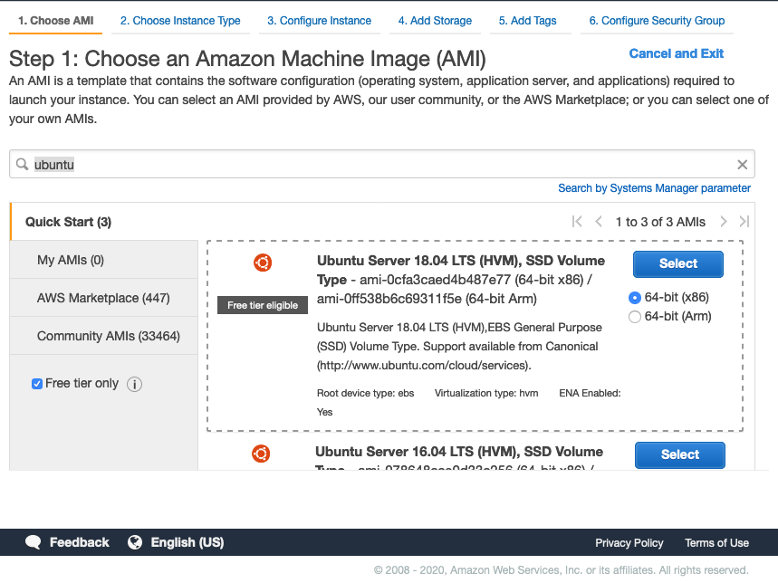

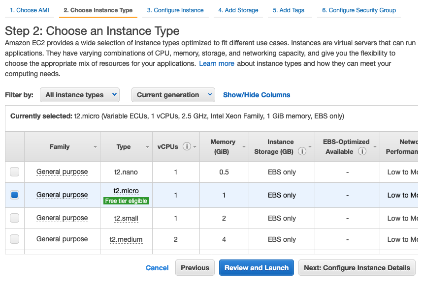

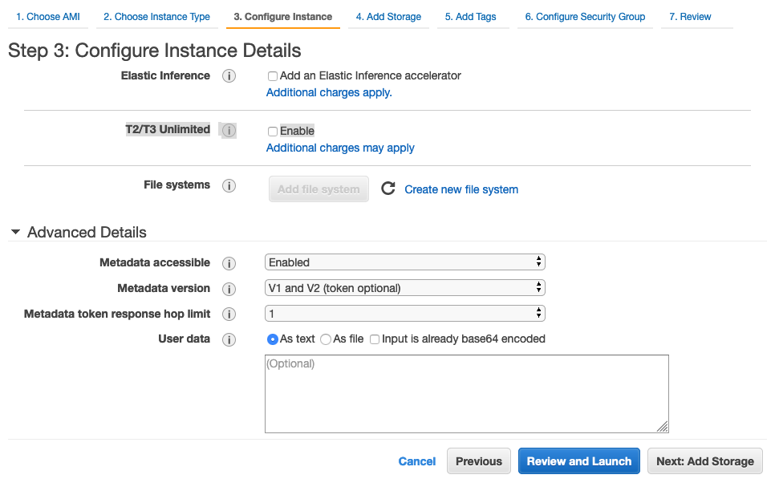

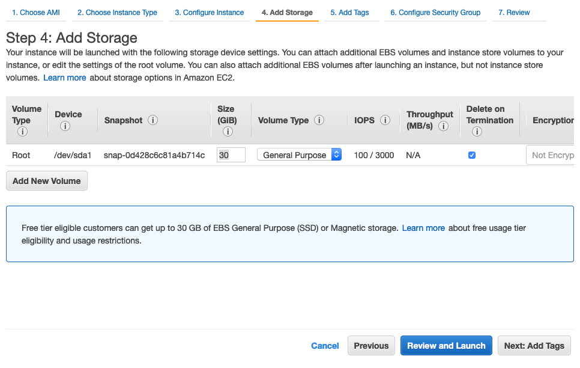

#### Allow SSH and RDP connections

Choose the security groups created in the previous step:

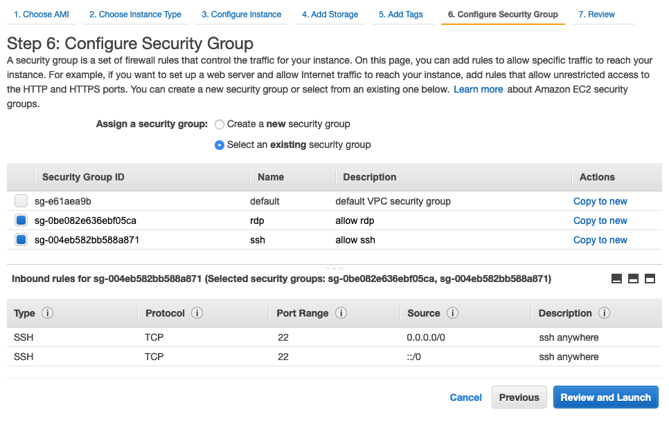

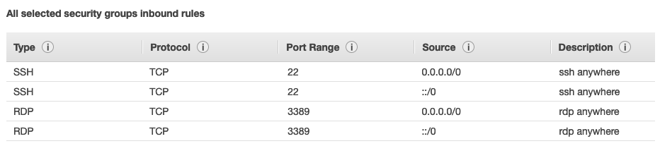

### Create and download a `.pem` key file

You should create this key file. If you don't create this and link it to the instance, you will not be able to connect to the instance via SSH or RDP. Here we create a new key file named `ssh_private_key`.

After that, click **Download Key Pair** and keep the key file save.

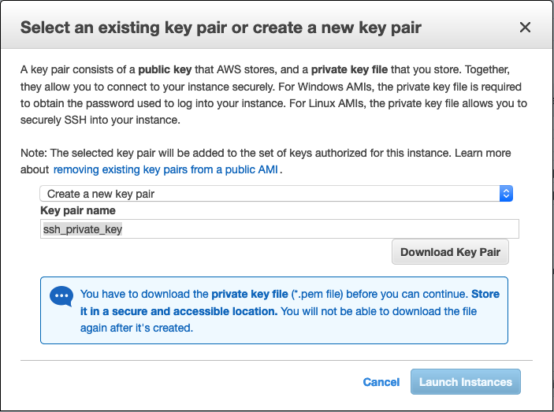


##### Do a `chmod` on the key file

You need to make sure that the `ssh_private_key.pem` downloaded is able to execute. Run `chmod` to change the permission:

```bash
❯ ll ~/Downloads/ | grep "ssh_private_key.pem"
-rw-r--r--@ 1 BEN  staff   1.7K Jul  2 18:41 ssh_private_key.pem

❯ chmod 400 ~/Downloads/ssh_private_key.pem

❯ ll ~/Downloads/ | grep "ssh_private_key.pem"
-r--------@ 1 BEN  staff   1.7K Jul  2 18:41 ssh_private_key.pem
```

## Connect to EC2 via SSH

Once you click the **Launch instance** , you should be able to see your instance in **running** state in the web console. Then, you can connect to the EC2 via ssh using the `pem` key file. Assuming that your DNS name of your EC2 is `ec2-0-1-2-3.ap-northeast-1.compute.amazonaws.com` and it is running at `ap-northeast-1` region, you can connect to it using user `ubuntu`:

```bash
❯ ssh -i ~/Downloads/ssh_private_key.pem ubuntu@ec2-0-1-2-3.region-name.compute.amazonaws.com
The authenticity of host 'ec2-0-1-2-3.region-name.compute.amazonaws.com (0.1.2.3)' can't be established.
ECDSA key fingerprint is SHA256:8t8ey5IqoiGOKGc9WuDc5SXaYqFHPnKph1mRtzbQNTc.
Are you sure you want to continue connecting (yes/no/[fingerprint])?
```

You need to confirm your fingerprint at the first connection attempt.

```bash
Welcome to Ubuntu 18.04.4 LTS (GNU/Linux 5.3.0-1023-aws x86_64)


 * Documentation:  https://help.ubuntu.com
 * Management:     https://landscape.canonical.com
 * Support:        https://ubuntu.com/advantage

  System information as of Thu Jul  2 10:54:37 UTC 2020

  System load:  0.0               Processes:           90
  Usage of /:   3.7% of 29.02GB   Users logged in:     0
  Memory usage: 16%               IP address for eth0: 172.31.4.8
  Swap usage:   0%

0 packages can be updated.
0 updates are security updates.

The programs included with the Ubuntu system are free software;
the exact distribution terms for each program are described in the
individual files in /usr/share/doc/*/copyright.

Ubuntu comes with ABSOLUTELY NO WARRANTY, to the extent permitted by
applicable law.

To run a command as administrator (user "root"), use "sudo <command>".
See "man sudo_root" for details.

ubuntu@ip-172-31-4-8:~$
```

## Install a GUI and RDP

### GUI: `LXDE`

I choose **LXDE** as the GUI of the ubuntu server: https://lxde.sourceforge.net/about.html.

>  LXDE is a new project aimed to provide a new desktop environment which is lightweight and fast

### RDP: `XRDP`

xrdp is an open-source Remote Desktop Protocol server: http://xrdp.org

> xrdp provides a graphical login to remote machines using RDP (Microsoft Remote Desktop Protocol)

Install the packages:

```bash
sudo apt-get update -y
sudo apt-get install lxde -y
sudo apt-get install xrdp -y
```

#### Set a password for your accout
You need to also set up a password for the *ubuntu*. This is for your later use in RDP as RDP only allows you to login an password-protected account.

```bash
sudo passwd ubuntu
```

### Connect to EC2 via remote desktop

For mac user, you need to download the [Microsoft Remote Desktop](https://apps.apple.com/us/app/microsoft-remote-desktop/id1295203466?mt=12). If you are using Windows, you should already have the Remote Desktop application preinstalled.

[](https://apps.apple.com/us/app/microsoft-remote-desktop/id1295203466?mt=12)

Launch the app and click **Add PC**:

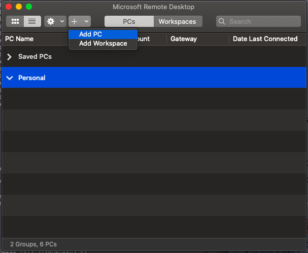

Set the PC name (i.e. the DNS name of your machine):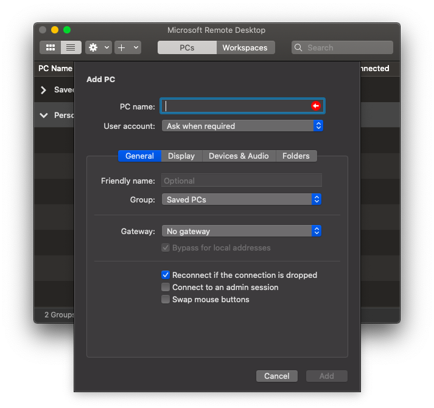

Login with user `ubuntu` and the password you set in the previous step.

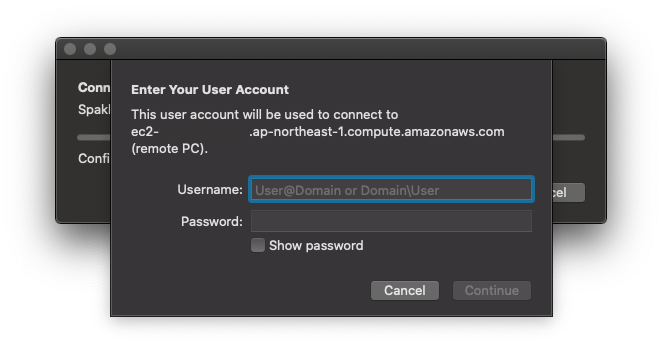

---

## Bonus Materials


### 1. Install additional IBus input method

If you want to type Japanese, Chinese, etc. you may need to install an input method. For cangjie, you can install [**Cangjians**](http://cangjians.github.io/projects/ibus-cangjie/install.html) via the terminal:

```bash
sudo apt-get install ibus-cangjie
```

### 2. Install Midori browser from `.deb` package

> **Midori Browser** is a browser web light, fast, secure, free software & open source

Download .deb file: https://astian.org/en/midori-browser/download/ or using `wget`:

```bash
cd ~/Downloads
sudo wget -qnc https://packages.astian.org/pool/main/m/midori/midori_9.0.0-1_amd64.deb
```

```bash
ubuntu@ip-172-31-4-8:~/Downloads$ ll
total 1492
drwxr-xr-x  2 ubuntu ubuntu    4096 Jul  2 11:29 ./
drwxr-xr-x 17 ubuntu ubuntu    4096 Jul  2 11:22 ../
-rw-r--r--  1 root   root   1517328 Jan 11 23:26 midori_9.0.0-1_amd64.deb
```

After that, install the `deb` package using `dpkg`

```bash
sudo dpkg -i midori_9.0.0-1_amd64.deb
```

You may see the `dependency problems` like the following: 

```bash
ubuntu@ip-172-31-4-8:~/Downloads$ sudo dpkg --configure -a
dpkg: dependency problems prevent configuration of midori:
 midori depends on libpeas-1.0-0 (>= 1.15); however:
  Package libpeas-1.0-0 is not installed.
 midori depends on libxml2-utils; however:
  Package libxml2-utils is not installed.
 midori depends on gstreamer1.0-plugins-bad; however:
  Package gstreamer1.0-plugins-bad is not installed.
 midori depends on gstreamer1.0-libav; however:
  Package gstreamer1.0-libav is not installed.

dpkg: error processing package midori (--configure):
 dependency problems - leaving unconfigured
Errors were encountered while processing:
 midori
```

In this case, update the packages and reinstall midori:
```bash
sudo dpkg --configure -a
sudo apt-get -f install
sudo apt-get update
sudo apt-get install midori
```

### 3. Set up a `swapfile` for better performance

```bash
ubuntu@ip-172-31-4-8:~$ sudo fallocate -l 1G /swapfile
ubuntu@ip-172-31-4-8:~$ sudo chmod 600 /swapfile
ubuntu@ip-172-31-4-8:~$ sudo mkswap /swapfile
Setting up swapspace version 1, size = 1024 MiB (1073737728 bytes)
no label, UUID=9a121c2c-cd6f-48bf-b928-e550095a3efd
ubuntu@ip-172-31-4-8:~$ sudo swapon /swapfile
ubuntu@ip-172-31-4-8:~$ sudo swapon --show
NAME      TYPE  SIZE USED PRIO
/swapfile file 1024M   0B   -2
ubuntu@ip-172-31-4-8:~$
```

```bash
sudo nano /etc/fstab
```

```bash
/swapfile swap swap defaults 0 0
```

After that, reboot the machine.

### 4. Use EC2 as a VPN server

Create a new security group allows all TCP and UDP inbound connections and add this security group to the EC2 instance:

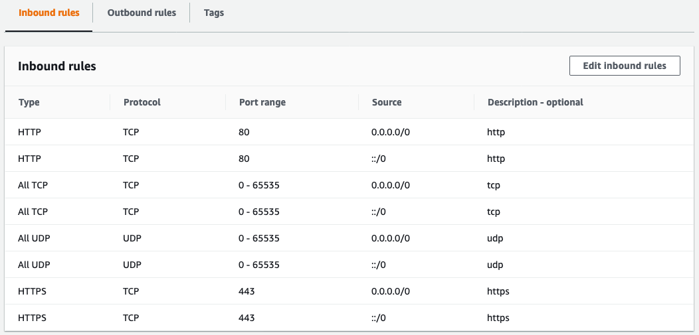

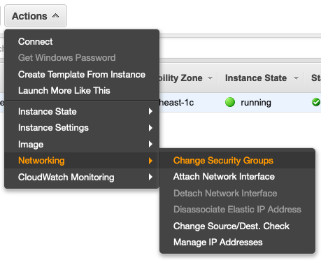

#### Install openvpn scripts

[This repo](https://github.com/Nyr/openvpn-install) contains scripts for VPN server set up and profile management. Install it into your EC2:

Download the script:

```bash
sudo apt update
sudo apt upgrade -y
mkdir ~/vpn && cd ~/vpn
wget https://git.io/vpn -O openvpn-install.sh
```

```bash
ubuntu@ip-172-31-4-8:~/vpn$ ll
total 32
drwxrwxr-x  2 ubuntu ubuntu  4096 Jul  2 12:11 ./
drwxr-xr-x 19 ubuntu ubuntu  4096 Jul  2 12:11 ../
-rw-rw-r--  1 ubuntu ubuntu 23085 Jul  2 12:11 openvpn-install.sh
```

Make the `openvpn-install.sh` exectable in your EC2:
```bash
chmod +x openvpn-install.sh
sudo ./openvpn-install.sh
```

Add a new profile by running `openvpn-install.sh`:
```bash
Welcome to this OpenVPN road warrior installer!

This server is behind NAT. What is the public IPv4 address or hostname?
Public IPv4 address / hostname [18.183.12.213]:

Which protocol should OpenVPN use?
   1) UDP (recommended)
   2) TCP
Protocol [1]: 1

What port should OpenVPN listen to?
Port [1194]:

Select a DNS server for the clients:
   1) Current system resolvers
   2) Google
   3) 1.1.1.1
   4) OpenDNS
   5) Quad9
   6) AdGuard
DNS server [1]: 1

Enter a name for the first client:
Name [client]: demo-ec2-client

OpenVPN installation is ready to begin.
Press any key to continue...
```

```bash
Finished!

The client configuration is available in: /home/ubuntu/demo-ec2-client.ovpn
New clients can be added by running this script again.
```

Use another Terminal to download the `.ovpn` file. Assuming that the machine name is `ec2-0-1-2-3.ap-northeast-1.compute.amazonaws.com` and the generated `.ovpn` file is place under `~/`:

```bash
scp -i sparkle.pem ubuntu@ec2-0-1-2-3.ap-northeast-1.compute.amazonaws.com:~/demo-ec2-client.ovpn ~/Downloads/demo-ec2-client.ovpn
```

#### Connect to the VPN

[Pritunl Client](https://client.pritunl.com/) is a easy-to-use OpenVPN client. Downlaod and install it.

Launch the client and click **Import Profile**:

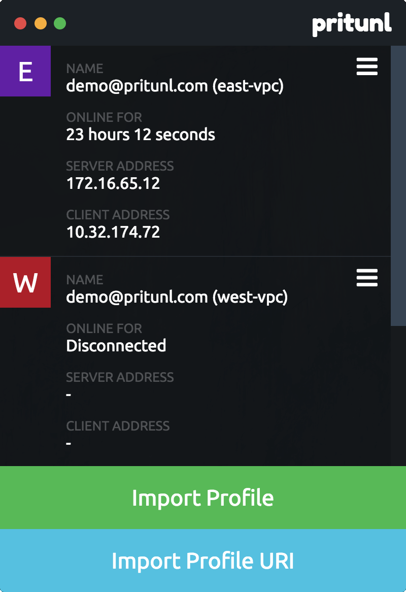


After that, click the burger menu of the profile and **Connect**.


---


Reference:

https://comtechies.com/how-to-set-up-gui-on-amazon-ec2-ubuntu-server.html