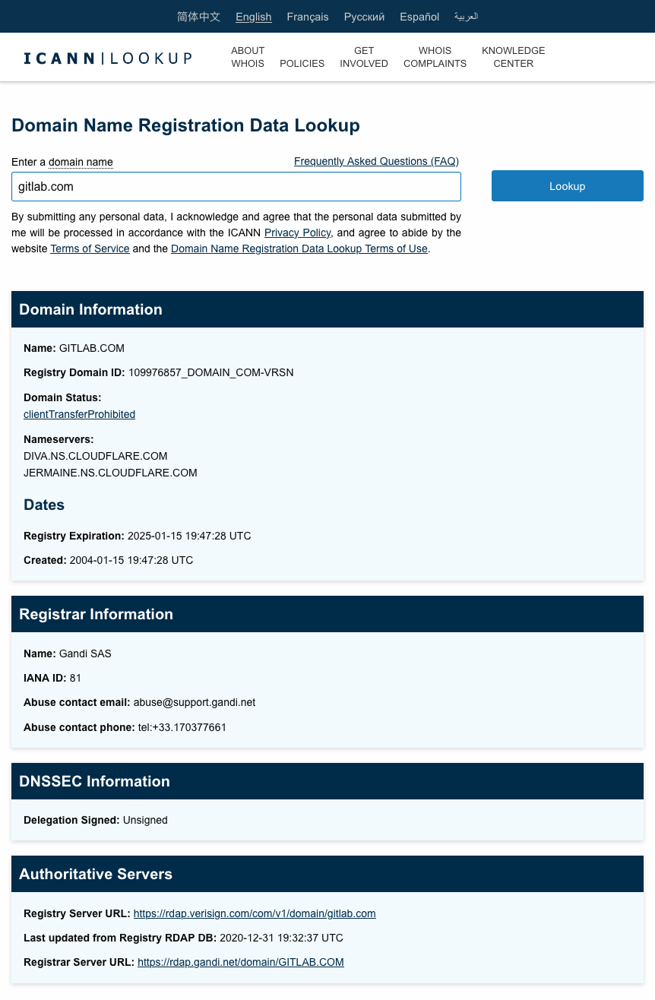
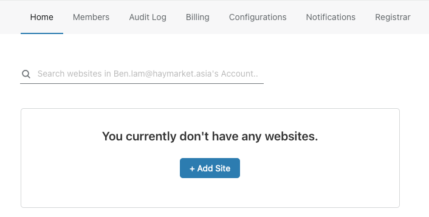
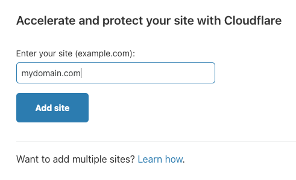
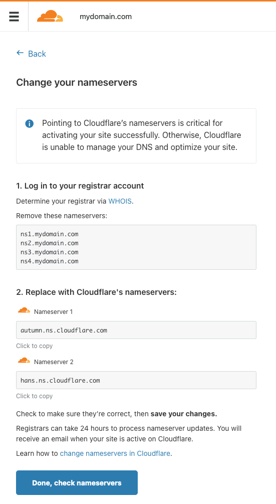

## Overview

This article shows how to configure Cloudflare for an existing website using AWS Route53.


## Domain Registrar

In my opinion, **domain registrar is the most confusing part when you configure Cloudflare**. To check the details of your domain, use the [**Domain Name Registration Data Lookup**](https://lookup.icann.org/lookup). Here is the lookup result of `gitlab.com`:



The Registrar Information section contains the information where you should change the nameservers in the next step.

### What about AWS Route53?

Route53 can be a domain registrar OR just managing the hosted zone. If you see AWS is the Registrar in this lookup, then you should update the config in AWS Route53.

##### Example 1: Domain purchased from GoDaddy

For example, if you purchased your domain in **GoDaddy** and having a **hosted zone** in **AWS Route 53** (That's my case), **GoDaddy is therefore your domain registrar and you should login GoDaddy's account to change the nameserver, NOT AWS Route 53** 

##### Example 2: Domain purchased from AWS Route 53

Unfortunately, You can purchased a domain in AWS Route 53 too. In this case, **AWS Route 53 is your domain registrar**.

You should change the nameservers in [the Route 53 console](https://console.aws.amazon.com/route53/) > **Registered Domains**.

#### What about NS Record?

Changing a `NS Record` is not the same as changing a `nameserver`. From the article [DNS NS record](https://www.cloudflare.com/learning/dns/dns-records/dns-ns-record/):

> The NS record indicates which DNS server is authoritative.

So, a `NS Record` is similar to `MX Record`, `CNAME Record`, `A Record`, etc. They are all the items under the domain.

Nameserver of the domain is at a higher level and it's controled by the domain registrar.

## Cloudflare Account

### Add a domain

It's free to create a Cloudflare account: https://dash.cloudflare.com/sign-up. Cloudflare also offer paid plans and I won't discuss them in this article.





Choose the free plan and then click **Continue**

After that, Cloudflare will do a DNS scan for the domain you've entered. Click **Continue**.

> **Note:** Not all the recoreds captured are correct. You will need to add/delete/update some of them later.

### Change your nameservers

The last step of setup is changing the nameservers. You will see the following instruction:



#### 1. Log in to your registrar account

In the previous section, you should know which service provider is your domain registrar. Login to your domain registrar and find out the nameserver config. Then, remove the existing nameservers (the entries shown in step 1). For example:

```
ns1.mydomain.com
ns2.mydomain.com
ns3.mydomain.com
ns4.mydomain.com
```

#### 2. Replace with Cloudflare's nameservers:

When all the existing nameservers are removed, you have to add the Cloudflare nameservers in the domain registrar. For example:

```
autumn.ns.cloudflare.com
hans.ns.cloudflare.com
```

Note: you have to enter the 2 nameservers shown in step 2. Other (Cloudflare) nameservers won't work.

### Verify nameservers

Again, lookup the domain details using  [**Domain Name Registration Data Lookup**](https://lookup.icann.org/lookup). This time you should check the details in the **Domain Information** section.

You should see the nameservers are replaced with the Cloudflare's nameservers.

> **Note:** **Changing nameservers is quick** and you should be able to see the updated records within 5 minutes. 
>
> On the other hand, changing the **records** under this domain may take a longer time (e.g. 24-48 hours). 
>
> **Do not mix them up**.

You may click the **Done, check nameservers** button once you finished changing the nameservers in your domain registrar.

## Updating DNS Records

As mentioned in the above, we have to change some of the records in Cloudflare.

### (Application) Load Balancers

You need to replace those A Records into CNAME Records.

In AWS Route 53 the load balancer records are in the forms of alias. Cloudflare will fetch the A Records of the load balancers.

Get the CNAME of your load balancer under **AWS EC2 Console** > **Load balancers** > Select your load balancer and see the details. After that, delete the A Record in Cloudflare and add a new CNAME record for your load balancer.

I used to keep the A Record in Cloudflare and it does work for few days. After that, the IP of that load balancer changed and the website cannot be connected.

### Amazon SES

I also found that the SPF and DKIM records for Amazon SES does not created in Cloudflare too. In this case you need to create those records manually in Cloudflare. Just follow the instruction provided by Amazon then you will know how to do:

- [Authenticating Email with SPF in Amazon SES](https://docs.aws.amazon.com/ses/latest/DeveloperGuide/send-email-authentication-spf.html)

- [Authenticating Email with DKIM in Amazon SES](https://docs.aws.amazon.com/ses/latest/DeveloperGuide/send-email-authentication-dkim.html)

## Summary

To use **Cloudflare**, you need to understand what a **domain registrar** is. By changing **nameservers** in a domain registrar and updating some records related to AWS's infrastructure, we can set up the Cloudflare domain for an existing website using **AWS Route 53**.

*This is the end of this article (as well as the year 2020).*