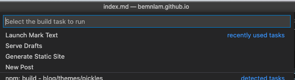

This post shows some useful VSCode tasks I set up to run and build Hugo.


Create a `tasks.json` under `.vscode`. Launch `.vscode/tasks.json` and make sure that you have `version`, `tasks` and `input` :

```json
{
    "version": "2.0.0",
    "tasks": [],
    "input": []
}
```

## 1. Launch Hugo Dev Server

```json
{
    "version": "2.0.0",
    "tasks": [
        {
            "label": "Serve Drafts",
            "type": "shell",
            "command": "hugo",
            "args": ["server", "-D"],
            "group": {
                "kind": "build",
                "isDefault": true
            },
            "isBackground": true,
            "options": {
                "cwd": "${workspaceFolder}/blog"
            }
        }
    ]
}
```

> Note: change the working directory when necessary. `${workspaceFolder}` is the directory contains `.vscode` folder

## 2. Launch a Mac Application

For example, I launch Mark Text in mac:

```json
{
    "label": "Launch Mark Text",
    "type": "shell",
    "command": "open",
    "args": [
        "-a",
        "\"Mark Text\"",
        "${workspaceFolder}/blog/content/posts",
        "&"
    ],
    "group": {
        "kind": "build",
        "isDefault": false
    },
    "isBackground": true,
    "options": {
        "cwd": "${workspaceFolder}/blog"
    }
}
```

## 3. Launch Script Requires User Input

For example, creating a new post requires user input the file name:

```json
{
    "version": "2.0.0",
    "tasks": [
        {
            "label": "New Post",
            "type": "shell",
            "command": "hugo",
            "args": [
                "new",
                "posts/${input:postTitlePrompt}/index.md"
            ],
            "group": {
                "kind": "build",
                "isDefault": true
            },
            "options": {
                "cwd": "${workspaceFolder}/blog"
            },
            "isBackground": true,
            "problemMatcher": []
        },
    ],
    "input": [
        {
            "id": "postTitlePrompt",
            "description": "Title of the new post",
            "type": "promptString"
        }
    ]
}
```

In this case, we have to create a `input` task to collect user's input first, and pass that value to the task.

## 4. Generate Hugo Static Site

Similar to the launc the dev task, we create a task to run `hugo build`:

```json
{
    "label": "Generate Static Site",
    "type": "shell",
    "command": "hugo",
    "group": {
        "kind": "build"
    },
    "options": {
        "cwd": "${workspaceFolder}/blog"
    }
}
```

Choose the task to run by <kbd>Command</kbd> + <kbd>Shift</kbd> + <kbd>B</kbd>:


